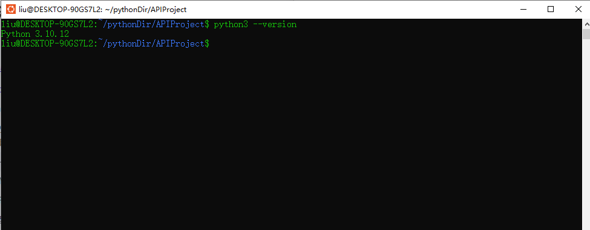
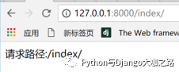
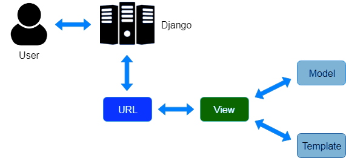

# 								Django

------

## Django的安装及第一个项目

------

如何安装虚拟环境和指定Django版本并通过一个简单的案例演示如何使用它。

------

### 如何安装Django

#### 检查Python版本

​		安装Django前先确保你的电脑或服务器上已经安装了Python的开发环境, 查看Python版本。这是因为Django版本可能与已安装的Python版本不兼容，比如Django 3.1仅支持Python 3.6、3.7、3.8或更高版本。

​		要查看已安装Python版本，Linux上可以直接在命令行输入Python，Windows系统下需要通过CMD进入终端后输入python命令查看python的版本，如下所示：



#### 创建虚拟环境

​		如果你在一台电脑上创建多个Python Web项目，每个项目会依赖不同版本的Python及第三方库，允许多个项目时大概率存在依赖冲突。更好的方式每个项目都有自己独立的开发环境，然后把项目所有依赖安装到隔离的环境中去，这就是虚拟环境的作用。

​		你可以通过Virtualenv或Pipenv创建虚拟环境，这里我们使用virtualenv。在linux和windows系统下，你均可以通过pip命令安装它。

```shell
# virtualenv的安装
pip install virtualenv
# 创建虚拟环境
virtualenv venv1
# 激活虚拟环境
.\venv1\Scripts\activate
# 退出虚拟环境
deactivate
```

​		接下来我们要创建一个存放Django项目代码的文件夹(这里为`myproject1`)，cd进入`myproject1`后使用`virtualenv venv1`命令创建一个名为`venv1`的虚拟环境，最后使用`.\venv1\bin\activate`激活虚拟环境（注意虚拟环境名别输错了)。当你看到项目文件夹的路径前面多了`(venv1)`括号时，说明你已进入虚拟环境了。

#### Django的安装及测试

进入虚拟环境，输入如下命令即可安装最新Django版本。当然你还可以通过`==`指定所需的Django版本。

```shell
pip install django
pip install django==5.0.1 # 安装指定版本
```

在Linux系统的命令行或windows的CMD终端中输入python即进入Python交互环境(shell)，然后可通过查看已安装的Django版本来确定Django已安装成功。

```python
>>> import django
>>> print(django.get_version())
5.0.1
```

### 第一个Django项目

进入`myproject1`的虚拟环境, 使用如下命令创建一个名为`mysite`的项目。

```shell
 django-admin startproject APIProject
```

你会看到`APIProject`目录下增加了一个名为`mysite’的文件夹和多个文件。每个文件夹和文件的作用如下所示：

```tex
|APIProject
├── APIProject
│   ├── __init__.py
│   ├── __pycache__
│   ├── admin.py
│   ├── asgi.py
│   ├── settings.py
│   ├── urls.py
│   └── wsgi.py
├── Readme.md
│   ├── admin.py
│   ├── apps.py
│   ├── migrations
│   ├── models.py
│   ├── serializers.py
│   ├── tests.py
│   ├── urls.py
│   └── views.py
└── manage.py
```

现在进入命令终端使用如下命令启动测试服务器：

```
python manage.py runserver [0.0.0.0:8000] #[]表示可写也可不写
```

此时打开浏览器访问http://127.0.0.1:8000/，你将看到熟悉的火箭标志页面(图片来源于网络)，如下所示：


### 编写自己的首页打印请求地址

前面展示的主页是Django自带的，现在我们要开始编写自己的首页，打印出当前请求路径。不过我们首先要创建一个新的应用(app)来实现这个功能。Django的一个项目(project)是可以包含多个应用(app)。

#### 创建新的app

使用`python manage.py startapp demo`命令创建一个名为demo的应用，然后把其加入项目配置文件`settings.py`的INSTALLED_APPS中去, 如下所示。这是你会发现`mysite`目录下多了`demo`文件夹，专门存放与应用相关的文件比如视图`views.py`和`urls.py`。

```python
INSTALLED_APPS = [
    'django.contrib.admin',
    'django.contrib.auth',
    'django.contrib.contenttypes',
    'django.contrib.sessions',
    'django.contrib.messages',
    'django.contrib.staticfiles',
    'demo', # 注册app
]
```

然后编辑`mysite/urls.py`, 把demo应用的urls也加入到项目的urls中去，如下所示：

```python
from django.contrib import admin
from django.urls import path, include

urlpatterns = [
    path('admin/', admin.site.urls),
    path('', include('demo.urls')) # 加入app对应urls
]
```

#### 编写视图函数和 URL 配置

编辑`demo/views.py`, 新增一个名为index的视图函数。每个视图函数的第一个默认参数都必需是`request`, 它是一个全局变量。Django把每个用户请求封装成了`request`对象，它包含里当前请求的所有信息，比如请求路径`request.path`, 当前用户`request.user`以及用户通过POST提交的数据`request.POST`。

index视图函数通过调用`HttpReponse`方法打印输出当前的请求路径`request.path`。

```python
# demo/views.py
from django.http import HttpResponse

def index(request):
    return HttpResponse("请求路径:{}" .format(request.path))
```

接下来我们要进行URL配置。新建`demo/urls.py`, 添加如下代码，其作用是将用户请求的地址与实际需要执行的视图函数相关联。下例中当用户在浏览器中访问index/时，Django将解析url，并调用执行views.py中的index视图函数。

#### 测试访问

使用`python manage.py runserver`命令重新启动测试服务器，并访问http://127.0.0.1:8000/index/, 你将看到如下页面：



------

## Django的MVT设计模式

------

介绍经典的软件开发所遵循的MVC (Model-View-Controller, 模型-视图-控制器) 设计模式以及Django的MVT设计模式(Model-View-Template)是如何遵循这种设计理念的。

------

### 经典的MVC设计模式及其优点

MVC即 Model-View-Controller(模型-视图-控制器) ，是经典的软件开发设计模式。

- **Model (模型) **： 简而言之即数据模型。模型不是数据本身（比如数据库里的数据），而是抽象的描述数据的构成和逻辑关系。通常模型包括了数据表的各个字段（比如人的年龄和出生日期）和相互关系（单对单，单对多关系等)。Web开发框架会根据模型的定义来自动生成数据表。
- **View (视图)**： 主要用于显示数据，用来展示用户可以看到的内容或提供用户可以输入或操作的界面。数据来源于哪里？当然是数据库啦。那么用户输入的数据给谁? 当然是给控制器啦。
- **Controller(控制器)**：应用程序中处理用户交互的部分。通常控制器负责从视图读取数据，控制用户输入，并向模型发送数据（比如增加或更新数据表）。

MVC最大的优点是实现了软件或网络应用开发过程中数据、业务逻辑和用户界面的分离，使软件开发更清晰，也是维护变得更容易。这与静态网页设计中使用html和css实现了内容和样式的分离是同一个道理。

### Django是如何遵循MVC设计模式的?

Django的MVT设计模式由Model(模型), View(视图) 和Template(模板)三部分组成，分别对应单个app目录下的models.py, views.py和templates文件夹。它们看似与MVC设计模式不太一致，其实本质是相同的。Django的MVT设计模式与经典的MVC对应关系如下。

- **Django Model(模型)**: 这个与经典MVC模式下的模型Model差不多。
- **Django View(视图)**: 这个与MVC下的控制器Controller更像。视图不仅负责根据用户请求从数据库读取数据、指定向用户展示数据的方式(网页或json数据), 还可以指定渲染模板并处理用户提交的数据。
- **Django Template(模板)**: 这个与经典MVC模式下的视图View一致。模板用来呈现Django view传来的数据，也决定了用户界面的外观。Template里面也包含了表单，可以用来搜集用户的输入内容。

Django MVT设计模式中最重要的是视图(view), 因为它同时与模型(model)和模板(templates)进行交互。当用户发来一个请求(request)时，Django会对请求头信息进行解析，解析出用户需要访问的url地址，然后根据路由urls.py中的定义的对应关系把请求转发到相应的视图处理。视图会从数据库读取需要的数据，指定渲染模板，最后返回响应数据。这个过程如下图所示：



### 示例

现在我们以示例演示Django的MVT三部分是如何工作的。

#### 新建app并注册

假如你有一个`mysite`项目，希望新增一个任务管理小应用，你首先要使用`python manage.py startapp tasks`的命令创建一个名为tasks的app，将它加入到`settings.py`中的INSTALLED_APP中去。

```python
# mysite/settings.py

INSTALLED_APPS = [
    'django.contrib.admin',
    'django.contrib.auth',
    'django.contrib.contenttypes',
    'django.contrib.sessions',
    'django.contrib.messages',
    'django.contrib.staticfiles',
    'tasks',
]
```

然后把tasks应用的urls添加到到项目的urls中去。

```python
# mysite/urls.py

from django.contrib import admin
from django.urls import path, include

urlpatterns = [
    path('admin/', admin.site.urls),
    path('tasks/', include('tasks.urls'))
]
```

#### 创建模型(M)

编辑tasks目录下`models.py`创建Task模型, Task模型包含里名称name和状态status两个字段。当你使用`python manage.py makemigrations`和`python manage.py migrate`命令时，Django会自动为你在数据库创建数据表(默认使用的数据库是免费的sqlite)，表名为`tasks_task`。

```python
    # tasks/models.py
    
    from django.db import models
    
    class Status(models.TextChoices):
        UNSTARTED = 'u', "Not started yet"
        ONGOING = 'o', "Ongoing"
        FINISHED = 'f', "Finished"
    
    # Task模型
    class Task(models.Model):
        name = models.CharField(verbose_name="Task name", max_length=65, unique=True)
        status = models.CharField(verbose_name="Task status", max_length=1, choices=Status.choices)
    
        def __str__(self):
            return self.name
```

#### 编写视图并配置路由URL(V)

接下来我们要编辑视图`views.py`，并新增一个视图函数 `task_list`, 用于展示任务清单。该视图函数从数据库读取了Task对象列表，指定了渲染模板并向模板传递了数据。

```python
# tasks/views.py
from django.shortcuts import render
from .models import Task

# 任务清单
def task_list(request):
    # 从数据库获取Task对象列表
    tasks = Task.objects.all()
    # 指定渲染模板并向模板传递数据
    return render(request, "tasks/task_list.html", { "tasks": tasks,})
```

#### 编辑模板(T)

最后我们要创建`task_list.html`用于展示视图传来的任务列表数据。这个文件的完整路径为`tasks/templates/tasks/task_list.html`。至于模板为什么放这里，我们后续会专门介绍。Django还提供了自己的模板语言，包括常见的判断和循环，专门用来渲染模板。

```html
# tasks/templates/tasks/task_list.html
<!DOCTYPE html>
<html lang="en">
<head>
    <meta charset="UTF-8">
    <title>Task List</title>
</head>
<body>
<h3>Task List</h3>

    <p>{{ forloop.counter }}. {{ task.name }} - {{ task.get_status_display }}
    </p>

</body>
</html>
```

当然此时如果你通过浏览器访问/tasks/, 还看不到任何内容，这是因为你的数据表里还没有任何数据。你可以通过django的admin添加或新增`task_create`视图实现。

### 一个任务管理CRUD小应用

#### 第一步：创建tasks应用，加入INSTALLED_APPS

本例假设你已经有了一个`mysite`的Django项目。我们首先使用 `python manage.py startapp tasks` 创建一个名为”tasks”的app，并把它计入到`settings.py`的INSTALLED_APPS中去。

```
# mysite/settings.py
INSTALLED_APPS = [
     'django.contrib.admin',
     'django.contrib.auth',
     'django.contrib.contenttypes',
     'django.contrib.sessions',
     'django.contrib.messages',
     'django.contrib.staticfiles',
     'tasks',
 ]
```

然后把app下的urls路径添加到项目文件夹的urls.py里去。

```
 from django.contrib import admin
 from django.urls import path, include

 urlpatterns = [
     path('admin/', admin.site.urls),
     path('tasks/', include('tasks.urls'))
 ]
```

#### 第二步：创建Task模型及其关联表单

我们的Task模型非常简单，仅包含name和status两个字段。我们还使用ModelForm类创建了TaskForm，我们在创建任务或更新任务时需要用到这个表单。

```python
# tasks/models.py
 from django.db import models

 class Status(models.TextChoices):
     UNSTARTED = 'u', "Not started yet"
     ONGOING = 'o', "Ongoing"
     FINISHED = 'f', "Finished"


 class Task(models.Model):
     name = models.CharField(verbose_name="Task name", max_length=65, unique=True)
     status = models.CharField(verbose_name="Task status", max_length=1, choices=Status.choices)

     def __str__(self):
         return self.name

 # tasks/forms.py
 from .models import Task
 from django import forms

 class TaskForm(forms.ModelForm):

     class Meta:
         model = Task
         fields = "__all__"
```

#### 第三步：编写路由URLConf及视图

我们需要创建5个urls, 对应5个函数视图。这是因为对于Retrieve操作，我们需要编写两个函数视图，一个用户获取任务列表，一个用于获取任务详情。对于`task_detail`, `task_update`和`task_delete`这个三个视图函数，我们还需要通过urls传递任务id或pk参数，否则它们不知道对哪个对象进行操作。

```python
# tasks/urls.py
 from django.urls import path, re_path
 from . import views

 # namespace
 app_name = 'tasks'

 urlpatterns = [
     # Create a task
     path('create/', views.task_create, name='task_create'),

     # Retrieve task list
     path('', views.task_list, name='task_list'),

     # Retrieve single task object
     re_path(r'^(?P<pk>\d+)/$', views.task_detail, name='task_detail'),

     # Update a task
     re_path(r'^(?P<pk>\d+)/update/$', views.task_update, name='task_update'),

     # Delete a task
     re_path(r'^(?P<pk>\d+)/delete/$', views.task_delete, name='task_delete'),
 ]
```

下面5个函数视图代码是本应用的核心代码，请仔细阅读并去尝试理解每一行代码。

```python
# tasks/views.py

 from django.shortcuts import render, redirect, get_object_or_404
 from django.urls import reverse
 from .models import Task
 from .forms import TaskForm
 
 # Create a task
 def task_create(request):
     # 如果用户通过POST提交，通过request.POST获取提交数据
     if request.method == "POST":
         # 将用户提交数据与TaskForm表单绑定
         form = TaskForm(request.POST)
         # 表单验证，如果表单有效，将数据存入数据库
         if form.is_valid():
             form.save()
             # 跳转到任务清单
             return redirect(reverse("tasks:task_list"))
     else:
         # 否则空表单
         form = TaskForm()
     return render(request, "tasks/task_form.html", { "form": form, })

 # Retrieve task list
 def task_list(request):
     # 从数据库获取任务清单
     tasks = Task.objects.all()
     # 指定渲染模板并传递数据
     return render(request, "tasks/task_list.html", { "tasks": tasks,})

 # Retrieve a single task
 def task_detail(request, pk):
     # 从url里获取单个任务的pk值，然后查询数据库获得单个对象
     task = get_object_or_404(Task, pk=pk)
     return render(request, "tasks/task_detail.html", { "task": task, })

 # Update a single task
 def task_update(request, pk):
     # 从url里获取单个任务的pk值，然后查询数据库获得单个对象实例
     task_obj = get_object_or_404(Task, pk=pk)
     if request.method == 'POST':
         form = TaskForm(instance=task_obj, data=request.POST)
         if form.is_valid():
             form.save()
             return redirect(reverse("tasks:task_detail", args=[pk,]))
     else:
         form = TaskForm(instance=task_obj)
     return render(request, "tasks/task_form.html", { "form": form, "object": task_obj})


 # Delete a single task
 def task_delete(request, pk):
     # 从url里获取单个任务的pk值，然后查询数据库获得单个对象
     task_obj = get_object_or_404(Task, pk=pk)
     task_obj.delete() # 删除然后跳转
     return redirect(reverse("tasks:task_list"))
```

#### 第四步：编写模板

虽然我们有5个urls，但我们只需要创建3个模板:`task_list.html`, `task_detail.html` 和`task_form.html。` 最后一个模板由`task_create` 和`task_update` 视图函数共享。我们在模板中对实例对象进行判断，如果对象已存在则模板对于更新任务，否则是创建任务。task_delete视图不需要模板。

```html
 # tasks/templates/tasks/task_list.html
 <!DOCTYPE html>
 <html lang="en">
 <head>
     <meta charset="UTF-8">
     <title>Task List</title>
 </head>
 <body>
 <h3>Task List</h3>
 
     <p>{{ forloop.counter }}. {{ task.name }} - {{ task.get_status_display }}
         (<a href="">Update</a> |
         <a href="">Delete</a>)
     </p>
 
 <p> <a href=""> + Add A New Task</a></p>
 </body>
 </html>


 # tasks/templates/tasks/task_detail.html
 <!DOCTYPE html>
 <html lang="en">
 <head>
     <meta charset="UTF-8">
     <title>Task Detail</title>
 </head>
 <body>
 <p> Task Name: {{ task.name }} | <a href="">Update</a> |
     <a href="">Delete</a>
 </p>
 <p> Task Status: {{ task.get_status_display }} </p>
 <p> <a href="">View All Tasks</a> |
     <a href="">New Task</a>
 </p>
 </body>
 </html>


 # tasks/templates/tasks/task_form.html
 <!DOCTYPE html>
 <html lang="en">
 <head>
     <meta charset="UTF-8">
     <title>Edit Task  Create New Task </title>
 </head>
 <body>
 <h3>Edit Task  Create New Task </h3>
     <form action="" method="post" enctype="multipart/form-data">
         
         {{ form.as_p }}
         <p><input type="submit" class="btn btn-success" value="Submit"></p>
     </form>
 </body>
 </html> 
```

#### 第五步：运行项目，查看效果

运行如下命令，访问http://127.0.0.1:8000/tasks/就应该看到文初效果了。

```shell
 python manage.py makemigrations
 python manage.py migrate
 python manage.py runserver
```

## Django模型详解

每个Django的模型(model)实际上是个类，继承了`models.Model`。每个Model应该包括属性(字段)，关系（比如单对单，单对多和多对多)和方法。当你定义好Model模型后，Django的接口会自动帮你在数据库生成相应的数据表(table)。

### 模型定义小案例

假设你要开发一个名叫`bookstore`的应用，专门来管理书店里的书籍。我们首先要为书本和出版社创建模型。出版社有名字和地址。书有名字，描述和添加日期。我们还需要利用ForeignKey定义了出版社与书本之间单对多的关系，因为一个出版社可以出版很多书，每本书都有对应的出版社。我们定义了`Publisher`和`Book`模型，它们都继承了`models.Model`。你能看出代码有什么问题吗?

```python
# models.py
from django.db import models
 
class Publisher(models.Model):
    name = models.CharField(max_length=30)
    address = models.CharField()
 
    def __str__(self):
        return self.name
		
class Book(models.Model):
    name = models.CharField(max_length=30)
    description = models.TextField(blank=True, null=True)
    publisher = ForeignKey(Publisher)
    add_date = models.DateField()
 
    def __str__(self):
        return self.name
```

模型创建好后，当你运行`python manage.py migrate` 命令创建数据表的时候你会遇到错误，错误原因如下：

- `CharField`里的`max_length`选项没有定义
- `ForeignKey(Publisher)`里的`on_delete`选项有没有定义

所以当你定义Django模型Model的时候，你一定要十分清楚2件事:

- 这个Field是否有必选项, 比如`CharField`的`max_length`和`ForeignKey`的`on_delete`选项是必须要设置的。
- 这个Field是否必需(blank = True or False)，是否可以为空 (null = True or False)。这关系到数据的完整性。

下面是订正错误后的Django模型：

```python
# models.py
from django.db import models
 
class Publisher(models.Model):
    name = models.CharField(max_length=30)
    address = models.CharField(max_length=60)
 
    def __str__(self):
        return self.name
		
class Book(models.Model):
    name = models.CharField(max_length=30)
    description = models.TextField(blank=True, default='')
    publisher = ForeignKey(Publisher,on_delete=models.CASCADE)
    add_date = models.DateField(auto_now_add=True)
 
    def __str__(self):
        return self.name
```

修改模型后，你需要连续运行`python manage.py makemigrations`和`python manage.py migrate`这两个命令，前者检查模型有无变化，后者将变化迁移至数据表。如果一切顺利，Django会在数据库(默认sqlite)中生成或变更由`appname_modelname`组成的数据表，本例两张数据表分别为`bookstore_publisher`和`bookstore_book`。
