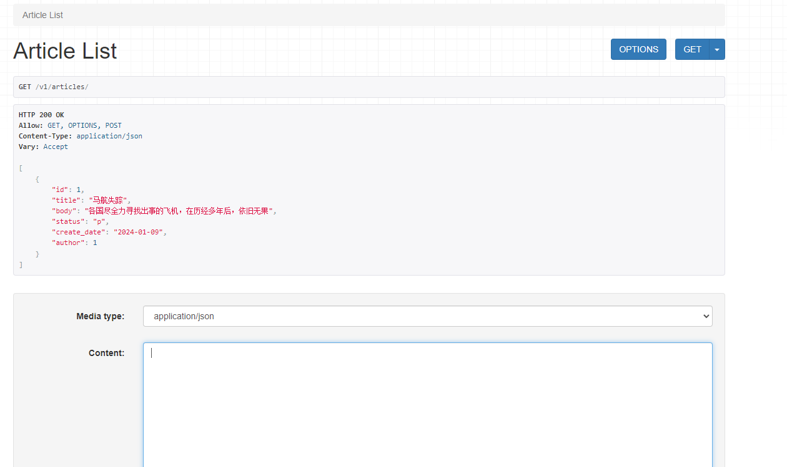
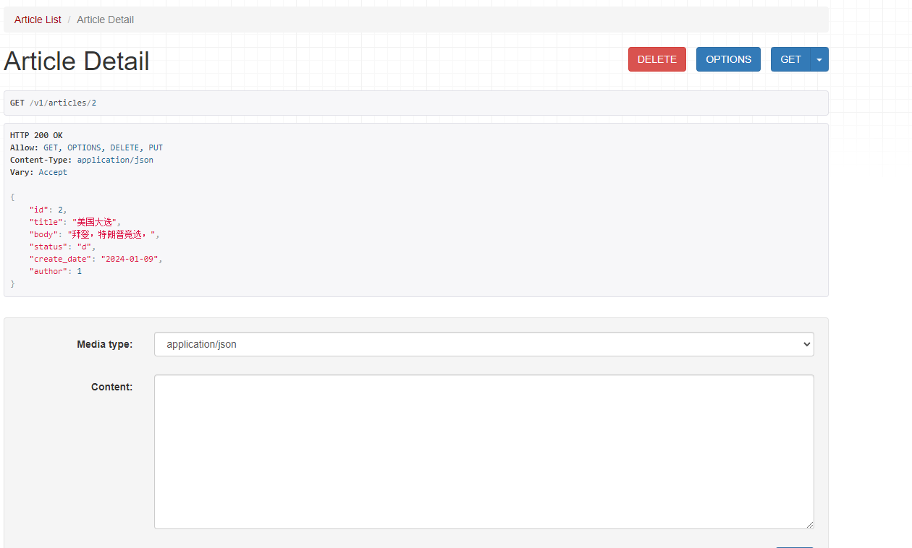
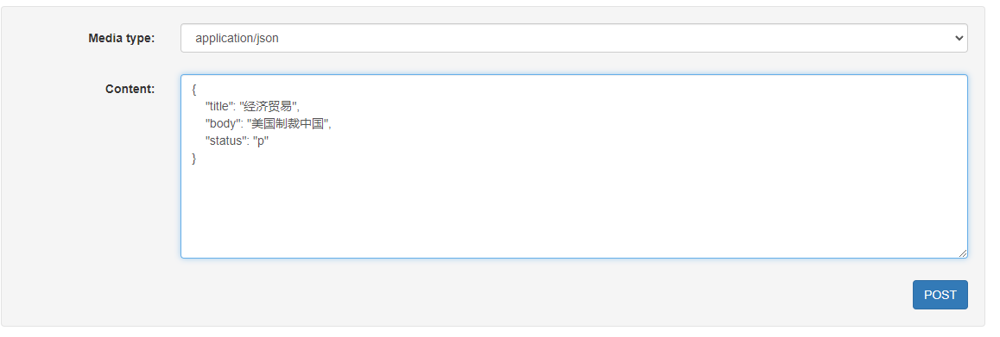
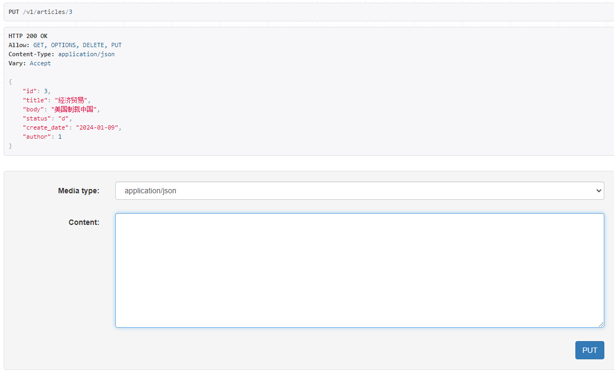
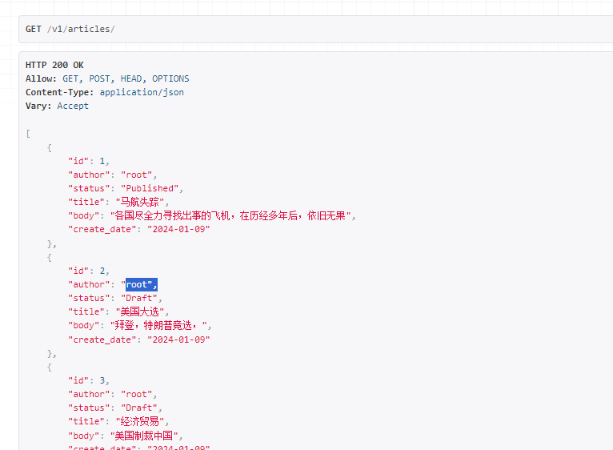
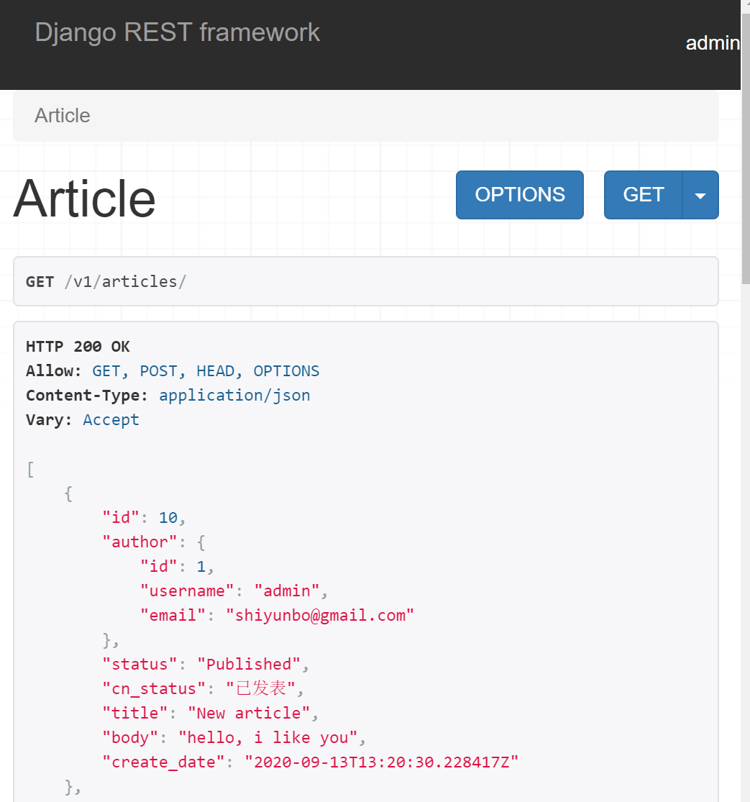
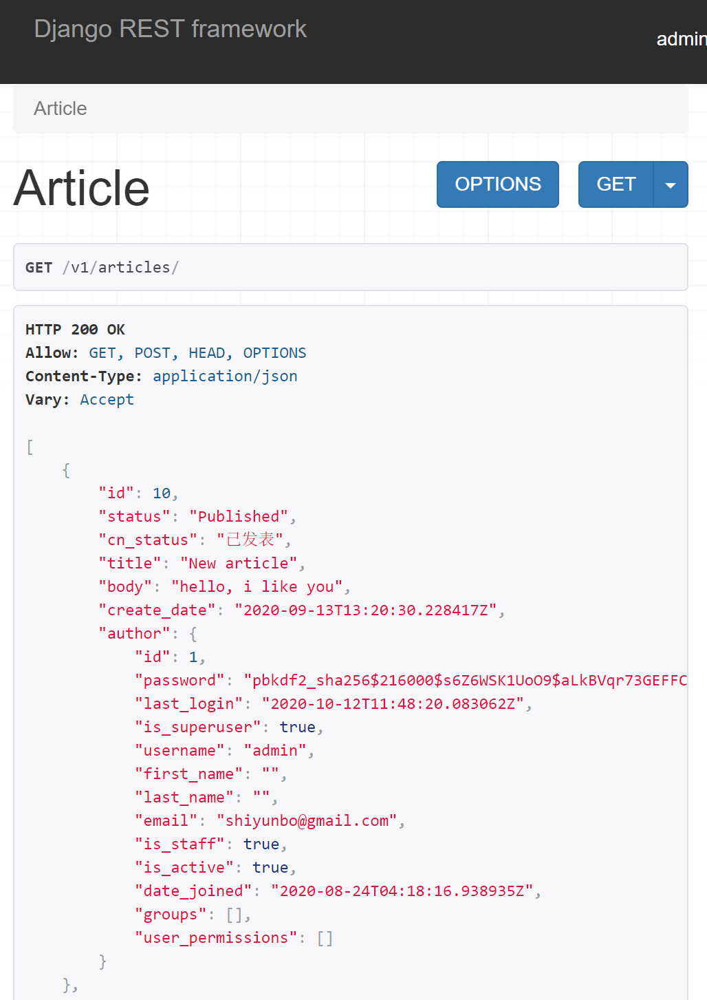
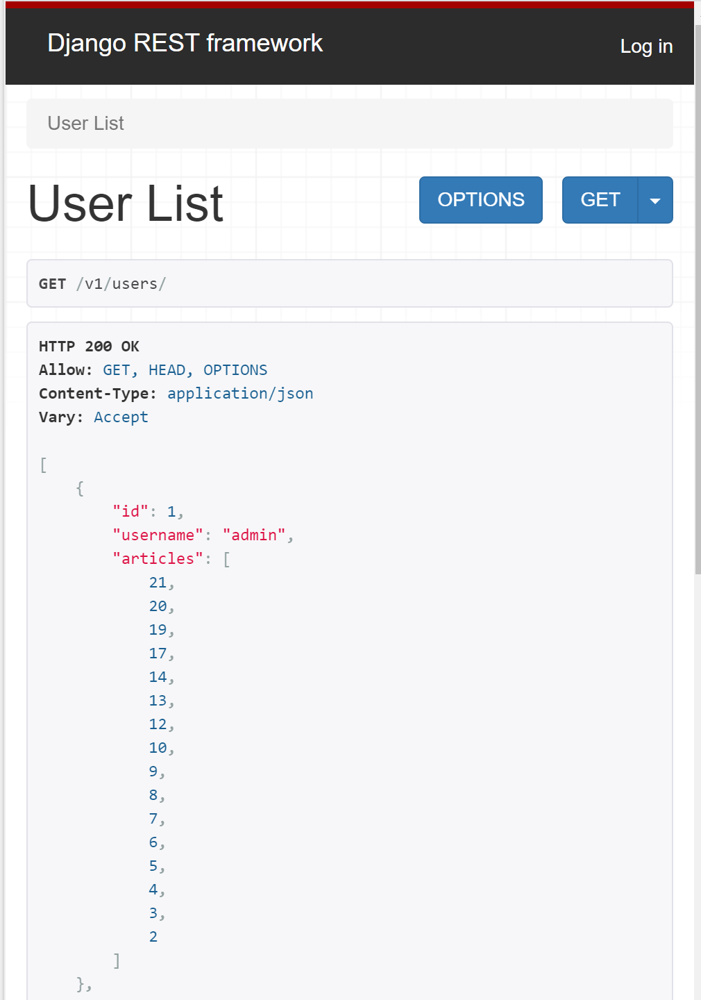
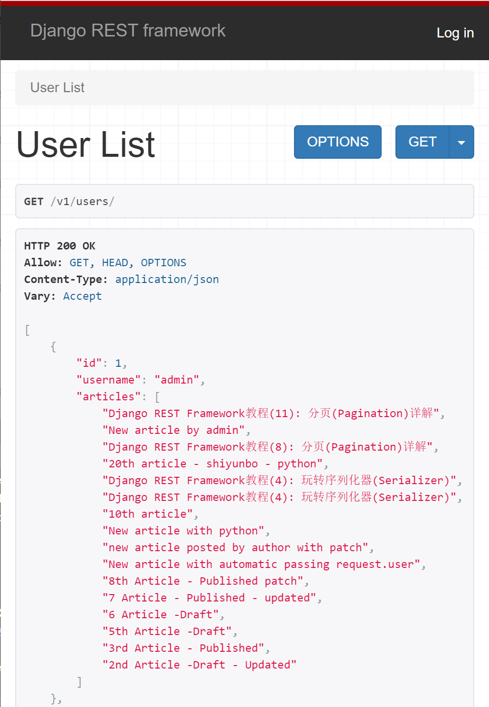
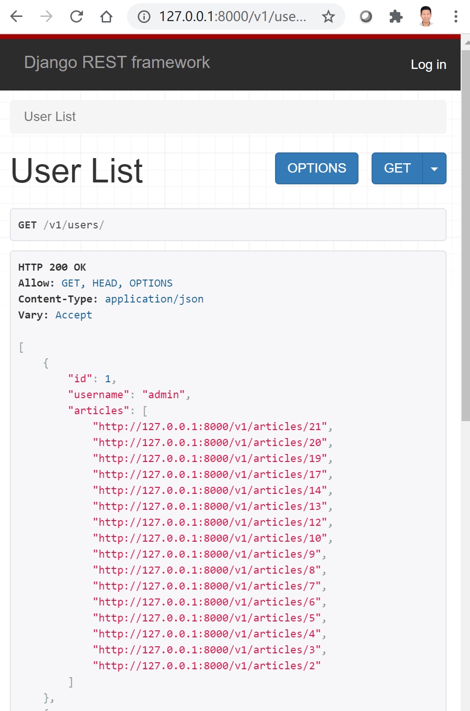

# 								Django REST Framework

Django这种基于MVC开发模式的传统框架，非常适合开发基于PC的传统网站，因为它同时包括了后端的开发(逻辑层、数据库层) 和前端的开发(如模板语言、样式)。

前后端分离,

------

## 为什么要学习Django REST Framework (DRF)？

Django REST framework 给Django提供了用于构建Web API 的强大而灵活的工具包, 包括序列化器、认证、权限、分页、过滤和限流。

### Django REST Framework的安装

如果需要在虚拟环境中实现， 需要执行

```shell
virtualenv env
source env/bin/activate
```

然后在虚拟环境中安装Django和Django REST Framework

```shell
pip install django
pip install djangorestframework
```

创建新项目和一个单个应用

```shell
django-admin.py startproject projectName
cd projectName
django-admin.py startapp firstApp
cd ..
```

如果想要获取一个图形化的页面来操作API，需要将 `rest_framework `注册到项目的`INSTALL_APPS`中，如下所示：

```python
INSTALLED_APPS = [
    'django.contrib.admin',
    'django.contrib.auth',
    'django.contrib.contenttypes',
    'django.contrib.sessions',
    'django.contrib.messages',
    'django.contrib.staticfiles',
    'rest_framework',
    'firstApp', # 你自己的app
]
```

**现在我们已经安装好DRF了，但在正式使用它开发API前我们还需要了解两件事情。什么是数据的序列化(Serialization)以及什么是RESTful规范的API, 这对于理解DRF中的序列化serializers类和每个API端点对应的url设计至关重要。**

### 序列化基础知识

将属于自己语言的数据类型或对象转换为可通过网络传输或可以存储到本地磁盘的数据格式（如：XML、JSON或特定格式的字节串）的过程称为序列化(seralization)；反之则称为反序列化。

#### Python数据序列化

Python自带json模块的dumps方法可以将python常用数据格式（比如列表或字典)转化为json格式,如下所示。你注意到了吗? 生成的json格式数据外面都加了单引号，这说明dict类型数据已经转化成了json字符串。

```python
>>>import json
>>>json.dumps({"name":"Mike", "score":112})
'{"name": "John", "score": 112}'
```

#### Django查询集序列化

Django编程就是是python编程，以上所介绍的序列化方法对django也是适用的。不同的是Django还有自己专属的数据类型比如查询集QuerySet和ValueQuerySet类型数据，还提供了自带的serializers类。使用Django自带的serializers类也可以轻易将QuerySet格式的数据转化为json格式。

```python
# Django Queryset数据 Json
from django.core import serializers
data = serializers.serialize("json", SomeModel.objects.all())
data1 = serializers.serialize("json", SomeModel.objects.all(), fields=('name', 'id'))
data2 = serializers.serialzie("json", SomeModel.objects.filter(field = some_value))
```

有时候我们只需要查询结果集的部分字段，可以使用`values('字段名','字段名2')`来要求返回所需要的数据，可以提升些性能，但是返回来的结果需要先转换成列表格式，再用` json.dumps()`方法序列化成json格式。示例代码如下所示:

```python
import json
from django.core.serializers.json import DjangoJSONEncoder

queryset = myModel.objects.filter(foo_icontains=bar).values('f1', 'f2', 'f3')
data4 = json.dumps(list(queryset), cls=DjangoJSONEncoder)
```

尽管Django自带的serializers类也能将Django的查询集QuerySet序列化成json格式数据，Django REST Framework才是你真正需要的序列化工具。与django自带的serializers类相比，D**RF的序列化器更强大**，可以根据模型生成序列化器，还能对客户端发送过来的数据进行验证。

#### 什么是符合RESTful规范的API?

REST是REpresentational State Transfer三个单词的缩写，由Roy Fielding于2000年论文中提出。简单来说，就是用URI表示资源，用HTTP方法(GET, POST, PUT, DELETE)表征对这些资源进行增删查改的操作。而如果你自己开发的API被称为RESTful API，就需要遵循其规定的约束。网上有很多文章对RESTful API规范做了详细介绍, 比如阮一峰的博客和简书, 我们这里只摘取总结部分精华内容，因为我们后面会用到。

##### 协议、域名和版本

尽量使用https协议，使用专属域名来提供API服务。API版本可以放在URL里面，也可以用HTTP的header进行内容协商，如下所示：

```tex
https://api.example.com/v1
http://www.example.com/api/v1
```

##### uri(统一资源标识符)

在RESTful架构中，每个网址代表一种资源（resource），这个网络地址就是uri (uniform resource identifier), 有时也被称为URL (uniform resource locator)。 因为URI对应一种资源，所以里面不能有动词，只能有名词。一般来说，数据库中的表都是同种记录的”集合”（collection），所以API中的名词也应该使用复数形式。

```tex
https://api.example.com/v1/users # 用户列表资源地址
https://api.example.com/v1/users/{id} # 用户id=5对应资源。注意：这里是users/5，而不是user/5
https://api.example.com/v1/users/{id}/articles # 用户id=5发表的文章列表
```

如果需要对一个用户信息进行编辑或删除，一个传统Django开发者可能将URL写成如下所示：

```tex
https://api.example.com/v1/users/{id}/edit/  #编辑用户
https://api.example.com/v1/users/{id}/delete/ #删除用户
```

上面URL设计其实是不符合RESTful规范的。一个 URI就应该是一个资源，本身不能包含任何动作 (action)。REST的规范是资源的URI地址是固定不变的，对同一资源应使用不同的HTTP请求方法进行不同的操作，比如常见的增删查改。

```tex
[POST]		https://api.example.com/v1/users	//新增
[GET]		https://api.example.com/v1/users/1	//查询
[PATCH]		https://api.example.com/v1/users/1 	//更新
[PUT]		https://api.example.com/v1/users/1	//覆盖，全部更新
[DELETE]	https://api.example.com/v1/users/1	//删除
```

有时候URL比较长，可能由多个单词组成，建议使用中划线”-“分割，而不是下划线”_“作为分隔符，另外每个url的结尾不能加斜线”/”。

```tex
https://api.example.com/v1/user-management/users/{id} # 好
https://api.example.com/v1/user_management/users/{id} # 不好
https://api.example.com/v1/user-management/users/{id}/ # 不好
```

##### HTTP请求方法

常用的HTTP请求方法有下面五个（括号里是对应的SQL命令)，每个方法对应一个操作。客户端在消费服务器提供的API服务时不仅要指定请求地址，还需指定请求方法。

```tex
GET（SELECT）：从服务器取出资源（一项或多项）。
POST（CREATE）：在服务器新建一个资源。
PUT（UPDATE）：在服务器更新资源（客户端提供改变后的完整资源）。
PATCH（UPDATE）：在服务器更新资源（客户端提供改变的属性）。
DELETE（DELETE）：从服务器删除资源。
```

另外还有两个不常用方法`HEAD`和`OPTIONS`，`HEAD`和`GET`本质是一样的，区别在于`HEAD`不含有呈现数据，而仅仅是HTTP头信息。`OPTIONS`极少使用，它主要用于获取当前URL所支持的方法。

##### 过滤（filtering）

如果记录数量很多，服务器不可能都将它们返回给用户。符合RESTful规范的API应该支持过滤。下面是一些常见的通过参数过滤的方式。

```tex
?limit=10：指定返回记录的数量
?offset=10：指定返回记录的开始位置。
?page=2&per_page=100：指定第几页，以及每页的记录数。
?sortby=name&order=asc：指定返回结果按照哪个姓名排序，以及排序顺序。
?user_type_id=1：指定筛选条件，比如用户类型
```

**注**：DRF与django-filter联用可以轻松实现过滤。

##### 状态码（Status Codes）

服务器在处理客户端请求后还应向用户返回响应的状态码和提示信息，常见的有以下一些状态码。

```tex
200 OK - [GET]：服务器成功返回用户请求的数据，该操作是幂等的（Idempotent）
201 CREATED - [POST/PUT/PATCH]：用户新建或修改数据成功
202 Accepted - [*]：表示一个请求已经进入后台排队（异步任务）
204 NO CONTENT - [DELETE]：用户删除数据成功
400 INVALID REQUEST - [POST/PUT/PATCH]：用户发出的请求有错误，服务器没有进行新建或修改数据的操作，该操作是幂等的。
401 Unauthorized - [*]：表示用户没有权限（令牌、用户名、密码错误）。
403 Forbidden - [*] 表示用户得到授权（与401错误相对），但是访问是被禁止的。
404 NOT FOUND - [*]：用户发出的请求针对的是不存在的记录，服务器没有进行操作，该操作是幂等的。
406 Not Acceptable - [GET]：用户请求的格式不可得（比如用户请求JSON格式，但是只有XML格式）。
410 Gone -[GET]：用户请求的资源被永久删除，且不会再得到的。
422 Unprocesable entity - [POST/PUT/PATCH] 当创建一个对象时，发生一个验证错误。
500 INTERNAL SERVER ERROR - [*]：服务器发生错误
```

**注**：DRF给出Respone时可以指定各种各样状态码，很容易使用。

##### Hypermedia API

```tex
{"link": {
  "rel":   "collection https://www.example.com/zoos",
  "href":  "https://api.example.com/zoos",
  "title": "List of zoos",
  "type":  "application/vnd.yourformat+json"
}}
```

**注**：DRF支持HyperLinkedModel，很容易实现这点。

## 以博客为例使用DRF的序列化器和基于函数的视图开发API

------

在本篇文章中我们将以博客为例，使用DRF提供的序列化器(Serializers类)开发两个API接口并测试。

这两个API端点的简单描述如下所示 (注意：规范的API文档需要更多信息)。

```tex
# 接口描述：文章列表资源。GET请求获取文章列表资源, POST请求提交新文章
# 接口地址: http://127.0.0.1:8000/api/v1/articles
# 请求方式：GET, POST
# 返回参数：JSON格式文章列表和状态码


# 接口描述：单篇文章资源。GET获取文章详情, PUT修改，DELETE删除
# 接口地址: http://127.0.0.1:8000/api/v1/articles/{id}
# 请求方式：GET, PUT, DELETE
# 返回参数: GET和PUT(JSON格式文章详情和状态码), DELETE(状态码)
```

### 准备工作

先要用virtualenv创建一个新的Python虚拟环境。如果你使用PyCharm创建Django项目，它会自动为你创建好一个虚拟环境。

```shell
virtualenv env
source env/bin/activate
```

虚拟环境激活后，我们就可以安装我们需要的包了。

```shell
pip install django
pip install djangorestframework
```

接下来我们使用如下命令创建一个名为`apiproject`的项目，另外创建一个名为`blog`的app。

```shell
django-admin.py startproject apiproject # 创建项目
cd apiproject # 进入项目目录
python manage.py startapp blog # 创建应用
```

我们需要将新建的`blog`app和`rest_framework`添加到`INSTALLED_APPS`。现在可以编辑`apiproject/settings.py`文件, 如下所示：

```python
INSTALLED_APPS =(
    ...
    'rest_framework',
    'blog',
)
```

**注意**: 如果你使用的Django版本很低或希望避免自己的app名与第三方库的app名冲突，你需要使用`blog.apps.BlogConfig`替换`blog`。

#### 创建模型 (models)

编辑`blog/models.py`文件, 创建`Article`模型，用于存储我们博客的文章数据。用户(User)与文章(Article)是单对多的关系(ForeinKey)，因为一个用户可以发表多篇文章。为了方便，用户模型我们使用了Django自带的用户模型。

```python
from django.db import models
#from django.utils.translation import ugettext_lazy as _ 高版本django已不支持
from django.utils.translation import gettext_lazy as _
from django.contrib.auth import get_user_model

User = get_user_model()

class Article(models.Model):
    """Article Model"""
    STATUS_CHOICES = (
        ('p', _('Published')),
        ('d', _('Draft')),
    )

    title = models.CharField(verbose_name=_('Title (*)'), max_length=90, db_index=True)
    body = models.TextField(verbose_name=_('Body'), blank=True)
    author = models.ForeignKey(User, verbose_name=_('Author'), on_delete=models.CASCADE, related_name='articles')
    status = models.CharField(_('Status (*)'), max_length=1, choices=STATUS_CHOICES, default='s', null=True, blank=True)
    create_date = models.DateTimeField(verbose_name=_('Create Date'), auto_now_add=True)

    def __str__(self):
        return self.title

    class Meta:
        ordering = ['-create_date']
        verbose_name = "Article"
        verbose_name_plural = "Articles"
```

模型创建好后，执行如下命令同步数据库并创建超级用户, Django会自动根据模型字段生成数据表。

```shell
python manage.py makemigrations
python manage.py migrate
python manage.py createsuperuser
```

之所以我们要创建超级用户是因为我们要通过Django自带的后台admin添加文章和用户信息, 以便测试我们的API接口能否正常工作

#### 配置Django后台(admin)

编辑`blog/admin.py`文件, 添加如下代码：

```python
from django.contrib import admin
from .models import Article

# Register your models here.
class ArticleAdmin(admin.ModelAdmin):
    list_display = ('title', 'author', 'status', 'create_date')
    
    '''filter options'''
    list_filter = ('status', )

    '''10 items per page'''
    list_per_page = 10
    
admin.site.register(Article, ArticleAdmin)
```

现在可以启动Django自带的测试服务器，进入admin后台添加些文章和用户(这里就不详细演示了)，接下来就可以开始我们的序列化工作了。

```python
python manage.py runserver
```

### 自定义序列化器(serializer)

利用DRF开发Web API的第一步总是自定义序列化器(serializers)。序列化器的作用是将模型实例(比如用户、文章)序列化和反序列化为诸如`json`之类的表示形式。一个模型实例可能有许多字段属性，但一般情况下你不需要把所有字段信息以JSON格式数据返回给用户。**序列化器定义了需要对一个模型实例的哪些字段进行序列化/反序列化, 并可对客户端发送过来的数据进行验证和存储**。

就像Django提供了`Form`类和`ModelForm`类两种方式自定义表单一样，REST framework提供了`Serializer`类和`ModelSerializer`类两种方式供你自定义序列化器。前者需手动指定需要序列化和反序列化的字段，后者根据模型(model)生成需要序列化和反序列化的字段，可以使代码更简洁。

下面我们将分别展示如何使用`Serializer`类和`ModelSerializer`类自定义序列化器

#### 使用Serializer类

在`blog`的目录下创建一个名为`serializers.py`文件，并添加以下内容。

```python
from rest_framework import serializers
from .models import Article
from django.contrib.auth import get_user_model

User = get_user_model()

class ArticleSerializer(serializers.Serializer):
    id = serializers.IntegerField(read_only=True)
    title = serializers.CharField(required=True, allow_blank=True, max_length=90)
    body = serializers.CharField(required=False, allow_blank=True)
    author = serializers.ReadOnlyField(source="author.id")
    status = serializers.ChoiceField(choices=Article.STATUS_CHOICES, default='p')
    create_date = serializers.DateTimeField(read_only=True)

    def create(self, validated_data):
        """
        Create a new "article" instance
        """
        return Article.objects.create(**validated_data)

    def update(self, instance, validated_data):
        """
        Use validated data to return an existing `Article`instance。"""
        instance.title = validated_data.get('title', instance.title)
        instance.body = validated_data.get('body', instance.body)
        instance.status = validated_data.get('status', instance.status)
        instance.save()
        return instance
```

序列化器类的第一部分定义了序列化/反序列化的字段。`create()`和`update()`方法定义了在调用`serializer.save()`时如何创建和修改完整的实例。

序列化器类与Django `Form`类非常相似，并在各种字段中设置各种验证，例如`required`，`max_length`和`default`。

**注意**：定义序列化器时一定要注明哪些是仅可读字段(`read-only fields`)，哪些是普通字段。对于read-only fields，客户端是不需要也不能够通过POST或PUT请求提交相关数据进行反序列化的。

本例中ID和create_date都是由模型自动生成，每个article的author我们也希望在视图中与request.user绑定，而不是由用户通过POST或PUT自行修改，所以这些字段都是read-only。相反title，body和status是用户可以添加或修改的字段，所以未设成read-only。

#### 使用ModelSerializer类

我们的`ArticleSerializer`类中重复了很多包含在`Article`模型（model）中的字段信息。使用`ModelSerializer`类可以重构我们的序列化器类，使整体代码更简洁。

```python
class ArticleSerializer(serializers.ModelSerializer):

    class Meta:
        model = Article
        fields = '__all__'
        read_only_fields = ('id', 'author', 'create_date')
```

如果你希望author不可见并让DRF根据request.user自动补全这个字段，可以按如下修改`ArticleSerializer`

```python
from rest_framework import serializers

class ArticleSerializer(serializers.ModelSerializer):
    author = serializers.HiddenField(default=serializers.CurrentUserDefault())

    class Meta:
        model = Article
        fields = '__all__'
        read_only_fields = ('id','create_date')
```

### 编写API视图(views.py)

接下来我们要使用自定义的序列化器来编写API视图，处理客户端的请求，并给出响应。与Django一样，DRF也支持使用基于函数的视图(Functional Based View, FBV)和基于类的视图(Class Based View, CBV)来编写视图(views)。

在本篇教程中，我们将编写两个基于函数的视图：`article_list`和`article_detail`。关于基于类的视图，我们会在下篇文章中介绍。

编辑`blog/views.py`文件，并且添加以下内容。

```python
from rest_framework import status
from rest_framework.decorators import api_view
from rest_framework.response import Response

from .models import Article
from .serializers import ArticleSerializer

@api_view(['GET', 'POST'])
def article_list(request):
    """
    List all articles, or create a new article.
    """
    if request.method == 'GET':
        articles = Article.objects.all()
        serializer = ArticleSerializer(articles, many=True)
        return Response(serializer.data)

    elif request.method == 'POST':
        serializer = ArticleSerializer(data=request.data)
        if serializer.is_valid():
            # Very important. Associate request.user with author
            serializer.save(author=request.user)
            return Response(serializer.data, status=status.HTTP_201_CREATED)
        return Response(serializer.errors, status=status.HTTP_400_BAD_REQUEST)
```

**注意**：由于序列化器中author是`read-only`字段，用户是无法通过POST提交来修改的，我们在创建Article实例时需手动将author和request.user绑定，如下所示：

```python
serializer.save(author=request.user)
```

以下是`views.py`模块中单个`article_detail`的视图。

```python
@api_view(['GET', 'PUT', 'DELETE'])
def article_detail(request, pk):
    """
    Retrieve，update or delete an article instance。"""
    try:
        article = Article.objects.get(pk=pk)
    except Article.DoesNotExist:
        return Response(status=status.HTTP_404_NOT_FOUND)

    if request.method == 'GET':
        serializer = ArticleSerializer(article)
        return Response(serializer.data)

    elif request.method == 'PUT':
        serializer = ArticleSerializer(article, data=request.data)
        if serializer.is_valid():
            serializer.save()
            return Response(serializer.data)
        return Response(serializer.errors, status=status.HTTP_400_BAD_REQUEST)

    elif request.method == 'DELETE':
        article.delete()
        return Response(status=status.HTTP_204_NO_CONTENT)
```

这两个函数视图看似和Django普通函数视图非常类似，但其作用大不相同。这里我们使用了DRF提供的`@api_view`这个非常重要的装饰器，实现了以下几大功能：

- 与Django传统函数视图相区分，强调这是API视图，并限定了可以接受的请求方法。
- 拓展了django原来的request对象。新的request对象不仅仅支持request.POST提交的数据，还支持其它请求方式如PUT或PATCH等方式提交的数据，所有的数据都在`request.data`字典里。这对开发                                                                                                                                                                                                                                                                                                                                                                                                                                                                                                                                                                                                                                                                                                                                                                                                                                                                                                                                                                                                                                                                                                        Web API非常有用。

```python
request.POST  # 只处理表单数据, 只适用于'POST'方法
request.data  # 处理任意数据, 适用于'POST'，'PUT'和'PATCH'方法
```

**注意**: 我们不再显式地将请求或响应绑定到特定的内容类型比如HttpResponse和JSONResponse，我们统一使用Response方法返回响应，该方法支持内容协商，可根据客户端请求的内容类型返回不同的响应数据。

### 给URLs添加可选的格式后缀

为了充分利用我们的响应不再与单一内容类型连接，我们可以为API路径添加对格式后缀(.json或.api)的支持。使用格式后缀给我们明确指定了给定格式的URL，能让我们的API将能够处理诸如`http://example.com/api/items/4.json`之类的URL。

首先要给视图函数添加一个`format=None`关键字参数。

```python
def article_list(request, format=None)
def article_detail(request, pk, format=None)
```

接着更新`blog/urls.py`文件，给现有的`urlpatterns`加上`format_suffix_patterns`。

```python
from django.urls import re_path
from rest_framework.urlpatterns import format_suffix_patterns
from . import views

urlpatterns = [
    re_path(r'^articles/$', views.article_list),
    re_path(r'^articles/(?P<pk>[0-9]+)$', views.article_detail),]

urlpatterns = format_suffix_patterns(urlpatterns)
```

最后我们还需要把app的urls加入到项目URL配置`apiproject/urls.py`文件中，如下所示：

```python
from django.contrib import admin
from django.urls import path, include

urlpatterns = [
    path('admin/', admin.site.urls),
    path('v1/', include('blog.urls')),
]
```

### API测试

启动Django服务器后，就可以开始测试我们的API是否工作正常了。测试工具有很多，比如简便的curl命令和强大的postman，我们这里使用DRF自带的图形化测试界面。

#### GET请求

```tex
[GET] http://127.0.0.1:8000/v1/articles
```



注意：DRF默认是以可浏览的api形式展示返回响应结果的(`articles.api`)，如果你只需要返回最简单的json格式的数据，只需要在访问地址后面加上`.json`后缀即可(articles.json)，如下所示：

```tex
[GET] http://127.0.0.1:8000/v1/articles/2
```

发送get请求到/v1/articles/2，获取第2篇文章详情。



#### POST请求

```
[POST] http://127.0.0.1:8000/v1/articles
```

发送POST请求到/v1/articles。在GET页面下方下拉框选择json格式数据或者表单，新增文章数据，点击POST提交后即可看到新的文章已经添加。



#### PUT请求

```
[PUT] http://127.0.0.1:8000/v1/articles/3
```

发送PUT请求到/v1/articles。在GET页面下方下拉框下选择json格式数据，数据为由序列化器中定义的非read-only字段组成的json对象，点击PUT提交后即可看到第3篇文章标题及状态已经由published变成draft。



### 其它请求

DELETE请求非常简单，点击页面上DELETE按钮即可，这里就不展示了。HEAD和OPTIONS请求很少用，这里也不展示了。

### 小结

本文介绍了DRF的两个序列化器类(Serializer类和ModelSerializer类), 并以博客为例使用基于函数的视图开发了两个简单的API端点并进行了测试。需要值得注意的有以下几点：

1. 定义序列化器时一定要注意区分read-only字段和常规字段，read-only字段仅可读，用户不能通过POST或PUT方法对其进行修改。
2. DRF中使用函数视图开发API千万别忘了使用`@api_view`这个重要的装饰器。

## 基于类的视图APIView, GenericAPIView和视图集(ViewSet)

------

### 为什么要使用基于类的视图(CBV)?

一个中大型的Web项目代码量通常是非常大的，如果全部使用函数视图写，那么代码的复用率是非常低的。而使用类视图呢，就可以有效的提高代码复用，因为类是可以被继承的，可以拓展的。特别是将一些可以共用的功能抽象成Mixin类或基类后可以减少重复造轮子的工作。

DRF推荐使用基于类的视图(CBV)来开发API, 并提供了4种开发CBV开发模式。

- 使用基础的`APIView`类
- 使用Mixins类和`GenericAPI`类混配
- 使用通用视图`generics.*`类, 比如`generics.ListCreateAPIView`
- 使用视图集`ViewSet`和`ModelViewSet`

很多人会疑惑，到底哪种CBV开发模式更好? 

### 使用基础APIView类

DRF的APIView类继承了Django自带的View类, 一样可以按请求方法调用不同的处理函数，比如get方法处理GET请求，post方法处理POST请求。不过DRF的APIView要强大得多。它不仅支持更多请求方法，而且对Django的request对象进行了封装，可以使用request.data获取用户通过POST, PUT和PATCH方法发过来的数据，而且支持插拔式地配置认证、权限和限流类。

现在我们可以使用APIView类重写我们之前的函数视图了。

```python
from rest_framework.views import APIView
from rest_framework.response import Response
from rest_framework import status
from django.http import Http404
from blog.models import Article
from blog.serializers import ArticleSerializer
#重写，采用视图类
class ArticleList(APIView):
    # List all articles, or create a new article
    def get(self, request, fromat=None):
        articles = Article.objects.all()
        serilalizer = ArticleSerializer(articles, many=True)
        return Response(serilalizer.data)

    def post(self, request, format=None):
        serializer = ArticleSerializer(data=request.data)
        if serializer.is_valid():
            #注意：手动将request.user与author绑定
            serializer.save(author=request.user)
            return Response(serializer.data, stauts=status.HTTP_201_CREATED)
        return Response(serializer.errors, status=status.HTTP_400_BAD_REQUEST)
    
class ArticleDetail(APIView):
    #retrieve, update or delete an article instance.
    def get_object(self, pk):
        try:
            return Article.objects.get(pk=pk)
        except Article.DoesNotExist:
            raise Http404
        
    def get(self, request, pk, format=None):
        article = self.get_object(pk)
        serializer = ArticleSerializer(article)
        return Response(serializer.data)
    
    def put(self, request, pk, format=None):
        article = self.get_object(pk)
        serializer = ArticleSerializer(isinstance=article, data=request.data)
        if serializer.is_valid():
            return Response(serializer.data)
        return Response(serializer.errors, status=status.HTTP_400_BAD_REQUEST)
    
    def delete(self, request, pk, format=None):
        article = self.get_object(pk)
        article.delete()
        return Response(status=status.HTTP_204_NO_CONTENT)
```

这段代码跟之前基于函数的视图差别并不大。最大不同的是我们不需要在对用户的请求方法进行判断。该视图可以自动将不同请求转发到相应处理方法，逻辑上也更清晰。

现在我们还需要修改应用的url配置, 让其指向新的基于类的视图。注意：类视图需要调用`as_view()`的方法才能在视图中实现查找指定方法, 比如GET请求执行get方法。

```python
# blog/urls.py
from django.urls import re_path
from rest_framework.urlpatterns import format_suffix_patterns

from . import views

urlpatterns = [
    # re_path(r'^articles/$', views.article_list),
    # re_path(r'^articles/(?P<pk>[0-9]+)$', views.article_detail),
    re_path(r'^articles/$', views.ArticleList.as_view()),
    re_path(r'^articles/(?P<pk>[0-9]+)$', views.ArticleDetail.as_view()),
]

urlpatterns = format_suffix_patterns(urlpatterns) 
```

### 用Mixin类和GenericAPI类混配

使用基础的APIView类并没有大量简化我们的代码。如果你仔细地观察，你还会发现与增删改查操作相关的代码包括返回内容对所有模型几乎都是一样的。比如你现在需要对文章类别Category模型也进行序列化和反序列化，你只需要复制Article视图代码，将Article模型改成Category模型, 序列化类由`ArticleSeralizer`类改成`CategorySerializer`类就行了。

对于这些通用的增删改查行为，DRF已经提供了相应的Mixin类。Mixin类可与`generics.GenericAPI`类联用，灵活组合成你所需要的视图。

现在来使用Mixin类和`generics.GenericAPI`类重写我们的类视图。

```python
# blog/views.py
# 使用Generic APIView & Mixins
from rest_framework import mixins
from rest_framework import generics

class ArticleList(mixins.ListModelMixin,
                  mixins.CreateModelMixin,
                  generics.GenericAPIView):
    queryset = Article.objects.all()
    serializer_class = ArticleSerializer

    def get(self, request, *args, **kwargs):
        return self.list(request, *args, **kwargs)

    def post(self, request, *args, **kwargs):
        return self.create(request, *args, **kwargs)
```

**GenericAPIView 类继承了APIView类，提供了基础的API视图。它对用户请求进行了转发，并对Django自带的request对象进行了封装。不过它比APIView类更强大，因为它还可以通过`queryset`和`serializer_class`属性指定需要序列化与反序列化的模型或queryset及所用到的序列化器类。**

这里的 `ListModelMixin` 和 `CreateModelMixin`类则分别引入了`.list() `和` .create() `方法，当用户发送get请求时调用Mixin提供的list()方法，将指定queryset序列化后输出，发送post请求时调用Mixin提供的create()方法，创建新的实例对象。

DRF还提供`RetrieveModelMixin`, `UpdateModelMixin`和`DestroyModelMixin`类，实现了对单个对象实例的查、改和删操作，如下所示：

```python
class ArticleDetail(mixins.RetrieveModelMixin,
                    mixins.UpdateModelMixin,
                    mixins.DestroyModelMixin,
                    generics.GenericAPIView):
    queryset = Article.objects.all()
    serializer_class = ArticleSerializer

    def get(self, request, *args, **kwargs):
        return self.retrieve(request, *args, **kwargs)

    def put(self, request, *args, **kwargs):
        return self.update(request, *args, **kwargs)

    def delete(self, request, *args, **kwargs):
        return self.destroy(request, *args, **kwargs)
```

或许你现在要问已经有get, post, delete等方法了，为什么mixin类引入的方法要以list, create, retrieve, destroy方法命名呢? 这是因为请求方法不如操作名字清晰，比如get方法同时对应了获取对象列表和单个对象两种操作，使用list和retrieve方法后则很容易区分。另外post方法接受用户发过来的请求数据后，有时只需转发不需要创建模式对象实例，所以post方法不能简单等于create方法。

新的ArticleList视图类看似正确，但其实还有一个问题。 我们定义的序列化器ArticleSeralizer类并不包含author这个字段的，这是因为我们希望在创建article实例时我们将author与request.user进行手动绑定。在前面的例子中我们使用`serializer.save(author=request.user)`这一方法进行手动绑定。

现在使用mixin类后，我们该如何操作呢？ 答案是重写`perform_create`方法，如下所示：

```python
class ArticleList(mixins.ListModelMixin,
                  mixins.CreateModelMixin,
                  generics.GenericAPIView):
    queryset = Article.objects.all()
    serializer_class = ArticleSerializer

    def get(self, request, *args, **kwargs):
        return self.list(request, *args, **kwargs)

    def post(self, request, *args, **kwargs):
        return self.create(request, *args, **kwargs)

    # 将request.user与author绑定。调用create方法时执行如下函数。
    def perform_create(self, serializer):
        serializer.save(author=self.request.user)
```

`perform_create`这个钩子函数是`CreateModelMixin`类自带的，用于执行创建对象时需要执行的其它方法，比如发送邮件等功能，有点类似于Django的信号。类似的钩子函数还有UpdateModelMixin提供的`perform_update`方法和DestroyModelMixin提供的`perform_destroy`方法。

### 使用通用视图Generics.*类

将Mixin类和GenericAPI类混配，已经帮助我们减少了一些代码，但我们还可以做得更好，比如将get请求与mixin提供的list方法进行绑定感觉有些多余。幸好DRF还提供了一套常用的将 Mixin 类与 GenericAPI类已经组合好了的视图，开箱即用，可以进一步简化我们的代码，如下所示：

```python
# generic class-based views
from rest_framework import generics

class ArticleList(generics.ListCreateAPIView):
    queryset = Article.objects.all()
    serializer_class = ArticleSerializer

    # 将request.user与author绑定
    def perform_create(self, serializer):
        serializer.save(author=self.request.user)

class ArticleDetail(generics.RetrieveUpdateDestroyAPIView):
    queryset = Article.objects.all()
    serializer_class =ArticleSerializer
```

顾名思义，`generics.ListCreateAPIView`类支持List、Create两种视图功能，分别对应GET和POST请求。`generics.RetrieveUpdateDestroyAPIView`支持Retrieve、Update、Destroy操作，其对应方法分别是GET、PUT和DELETE。

寥寥几行，实现了我们所有想要的功能，神不神奇?

其它常用generics类视图还包括`ListAPIView`, `RetrieveAPIView`, `RetrieveUpdateAPIView`等等。你可以根据实际需求使用，为你的API写视图时只需要定义`queryset`和`serializer_class`即可。

### 使用视图集ViewSet

使用通用视图generics类后视图代码已经大大简化，但是`ArticleList`和`ArticleDetail`两个类中`queryset`和`serializer_class`属性依然存在代码重复。使用视图集可以将两个类视图进一步合并，一次性提供List、Create、Retrieve、Update、Destroy这5种常见操作，这样`queryset`和`seralizer_class`属性也只需定义一次就好, 这就变成了视图集(viewset)。

如下所示：

```python
# blog/views.py
from rest_framework import viewsets

class ArticleViewSet(viewsets.ModelViewSet):
    # 用一个视图集替代ArticleList和ArticleDetail两个视图
    queryset = Article.objects.all()
    serializer_class = ArticleSerializer
    
    # 自行添加，将request.user与author绑定
    def perform_create(self, serializer):
        serializer.save(author=self.request.user)
```

使用视图集后，我们需要使用DRF提供的路由router来分发urls，因为一个视图集现在对应多个urls，而不像之前的一个url对应一个视图函数或一个视图类。

```python
# blog/urls.py
from django.urls import re_path
from rest_framework.urlpatterns import format_suffix_patterns
from . import views
from rest_framework.routers import DefaultRouter

router = DefaultRouter()
router.register(r'articles', viewset=views.ArticleViewSet)

urlpatterns = [
    # re_path(r'^articles/$', views.ArticleList.as_view()),
    # re_path(r'^articles/(?P<pk>[0-9]+)$', views.ArticleDetail.as_view()),
]
# urlpatterns = format_suffix_patterns(urlpatterns)
urlpatterns += router.urls
```

一个视图集对应List、Create、Retrieve、Update、Destroy这5种操作。有时候我只需要其中的一种或几种操作，该如何实现呢？答案是在`urls.py`中指定方法映射即可，如下所示：

```python
# blog/urls.py

from django.urls import re_path
from rest_framework.urlpatterns import format_suffix_patterns
from . import views

# from rest_framework.routers import DefaultRouter
# router = DefaultRouter()
# router.register(r'articles', viewset=views.ArticleViewSet)

article_list = views.ArticleViewSet.as_view(
    {
        'get': 'list',
        'post': 'create'
    })

article_detail = views.ArticleViewSet.as_view({
    'get': 'retrieve', # 只处理get请求，获取单个记录
})


urlpatterns = [
    re_path(r'^articles/$', article_list),
    re_path(r'^articles/(?P<pk>[0-9]+)$', article_detail),
]

urlpatterns = format_suffix_patterns(urlpatterns)
```

另外DRF还提供了`ReadOnlyModelViewSet`这个类，它仅支持list和retrive这两个可读的操作，如下所示：

```python
from rest_framework import viewsets

class UserViewSet(viewsets.ReadOnlyModelViewSet):
    """
    ReadOnlyModelViewSet仅提供list和detail可读动作
    """
    queryset = Article.objects.all()
    serializer_class = ArticleSerializer
```

Django视图集viewset代码最少，但这是以牺牲了代码的可读性为代价的，因为它对代码进行了高度地抽象化。另外urls由router生成，不如自己手动配置的清楚。

### 小结

本文使用了DRF提供的多种基于类的API视图的重写了文章资源API。那么这几种方式到底哪种更好呢? 答案是各有利弊。小编个人认为大家只需掌握以下三种方式即可：

- 基础的API类：可读性最高、代码最多、灵活性最高。当你需要对的API行为进行个性化定制时，建议使用这种方式。
- 通用generics类：可读性好、代码适中、灵活性较高。当你需要对一个模型进行标准的增删查改全部或部分操作时建议使用这种方式。
- 使用视图集viewset: 可读性较低、代码最少、灵活性最低。当你需要对一个模型进行标准的增删查改的全部操作且不需定制API行为时建议使用这种方式。

## 玩转序列化器(Serializer)

------

在前面的文章中我们以博客为例，自定义了一个简单的 `ArticleSerializer` 类, 并分别以函数视图(FBV)和基于类的视图(CBV)编写了博客文章列表资源和单篇文章资源的API。在本文中，我们将玩转DRF的序列化器，教你如何修改序列化器，控制序列化后响应数据的输出格式, 如何在反序列化时对客户端提供过来的数据进行验证(validation)以及如何动态加载或重写序列化器类自带的方法。

------

### 准备工作

Article模型和自定义的序列化器`ArticleSerializer`类分别如下所示。

```python
# blog/models.py
class Article(models.Model):
    """Article Model"""
    STATUS_CHOICES = (
        ('p', 'Published'),
        ('d', 'Draft'),
    )

    title = models.CharField(verbose_name='Title (*)', max_length=90, db_index=True)
    body = models.TextField(verbose_name='Body', blank=True)
    author = models.ForeignKey(User, verbose_name='Author', on_delete=models.CASCADE, related_name='articles')
    status = models.CharField(verbose_name='Status (*)', max_length=1, choices=STATUS_CHOICES, default='s', null=True, blank=True)
    create_date = models.DateTimeField(verbose_name='Create Date', auto_now_add=True)


    def __str__(self):
        return self.title
```

初的`ArticleSerializer`如下所示：

```python
# blog/serializers.py
class ArticleSerializer(serializers.ModelSerializer):


    class Meta:
        model = Article
        fields = '__all__'
        read_only_fields = ('id', 'author', 'create_date')
```

我们自定义的序列化器`ArticleSerializer`类包括了Article模型的所有字段，但由于我们不希望用户自行修改`id`, `author`和`create_date`三个字段，我们把它们设成了仅可读`read_only_fields`。如果你的其它代码正确，当你发送GET请求到/v1/articles, 我们可以看HTTP=200 OK的字样和如下json格式的文章列表数据。

在这里你可以看到序列化后输出的json格式数据里author字段输出的是用户id，而不是用户名，status输出的是p或者d，而不是输出Published或Draft这样的完整状态，这显然对用户不是很友好的。这时我们就要修改序列化器，改变序列化后的数据输出格式，接下来我们将介绍几种常用的方式。

### 改变序列化器的输出

#### 指定source来源

打开`blog/serializers.py`，新建两个可读字段`author和status`字段，用以覆盖原来Article模型默认的字段，其中指定author字段的来源(source)为单个author对象的username，status字段为`get_status_display`方法返回的完整状态。

```python
class ArticleSerializer(serializers.ModelSerializer):
    author = serializers.ReadOnlyField(source="author.username")
    status = serializers.ReadOnlyField(source="get_status_display")

    class Meta:
        model = Article
        fields = '__all__'
        read_only_fields = ('id', 'author', 'create_date')
```



这个看似完美，但里面其实有个错误。我们定义了一个仅可读的status字段把原来的status字段覆盖了，这样反序列化时用户将不能再对文章发表状态进行修改（原来的status字段是可读可修改的）。一个更好的方式在`ArticleSerializer`新增一个为`full_status`的可读字段，而不是简单覆盖原本可读可写的字段。

#### 使用SerializerMethodField方法

上面例子中文章状态status都是以Published或Draft英文字符串表示的，但是如果你想在输出的json格式数据中新增`cn_status`字段，显示中文发表状态。但cn_status本身并不是Article模型中存在的字段，这时你应该怎么做呢？答案是使用`SerializerMethodField`，它可用于将任何类型的数据添加到对象的序列化表示中, 非常有用。

再次打开blog/serializers.py，新建`cn_status`字段，类型为SerializerMethodField，然后再自定义一个`get_cn_status`方法输出文章中文发表状态即可。

```python
class ArticleSerializer(serializers.ModelSerializer):
    author = serializers.ReadOnlyField(source="author.username")
    status = serializers.ReadOnlyField(source="get_status_display")
    cn_status = serializers.SerializerMethodField()

    class Meta:
        model = Article
        fields = '__all__'
        read_only_fields = ('id', 'author', 'create_date')

    def get_cn_status(self, obj):
        if obj.status == 'p':
            return "已发表"
        elif obj.status == 'd':
            return "草稿"
        else:
            return ''
```

**不过需要注意的是`SerializerMethodField`通常用于显示模型中原本不存在的字段，类似可读字段，你不能通过反序列化对其直接进行修改。**

#### 使用 to_representation方法

除了指定source和自定义序列化方法，`to_representation()` 也允许我们改变序列化的输出内容, 给其添加额外的数据。

假设我们有如下一个文章模型(Article)：

```python
from django.contrib.auth.models import User
from django.db import models

class Article(models.Model):
    title = models.CharField(max_length=256)
    body = models.TextField()
    liked_by = models.ManyToManyField(to=User)
    
    def __str__(self):
        return self.title
```

每个文章资源有 `title`, `body`和` liked_by` 三个字段。`liked_by` 代表喜欢该文章的用户对象id列表。

我们的序列化器`ArticleSerializer`类如下所示：

```python
from rest_framework import serializers
from .models import Article

class ArticleSerializer(serializers.ModelSerializer):
    class Meta:
        model = Article
        fields = '__all__'
```

如果我们使用上面序列化器去序列化单篇文章资源，我们将得到如下输出数据：

```python
{
   "id": 1,
   "title": "DRF advanced tutorials",
   "body": "This is a good example.",
   "liked_by": [
      2,
      3,
      4
   ]
}
```

现在如果我们希望给上面输出数据添加一个`total_likes`点赞总数的字段，我们只需要在序列化器类里重写`to_representation`方法。

```python
from rest_framework import serializers
from .models import Article


class ArticleSerializer(serializers.ModelSerializer):
    class Meta:
        model = Article
        fields = '__all__'
        
    def to_representation(self, value):
        # 调用父类获取当前序列化数据，value代表每个对象实例ob
        data = super().to_representation(value)
        # 对序列化数据做修改，添加新的数据
        data['total_likes'] = value.liked_by.count()
        return data
```

现在使用新的序列化器类去序列化单篇文章资源，我们将得到如下输出结果。`to_representation() `方法改变了我们序列化的输出，并传递了额外的数据。

```json
{ 
   "id": 1,
   "title": "DRF advanced tutorials",
   "body": "This is a good example.",
   "liked_by": [
      2,
      3,
      4
   ],
   "total_likes": 3
}
```

#### 使用嵌套序列化器

我们文章中的author字段实际上对应的是一个User模型实例化后的对象，既不是一个整数id，也不是用户名这样一个简单字符串，我们怎样显示更多用户对象信息呢? 其中一种解决方法是使用嵌套序列化器，如下所示：

```python
class UserSerializer(serializers.ModelSerializer):

    class Meta:
        model = User
        fields = ('id', 'username', 'email')

class ArticleSerializer(serializers.ModelSerializer):
    author = UserSerializer() # required=False表示可接受匿名用户，many=True表示有多个用户。
    status = serializers.ReadOnlyField(source="get_status_display")
    cn_status = serializers.SerializerMethodField()

    class Meta:
        model = Article
        fields = '__all__'
        read_only_fields = ('id', 'author', 'create_date')

    def get_cn_status(self, obj):
        if obj.status == 'p':
            return "已发表"
        elif obj.status == 'd':
            return "草稿"
        else:
            return ''
```

展示效果如下所示：



此时发送GET请求展示文章列表资源是没问题的，但如果你希望发送POST请求到v1/articles/提交新文章你将会收到author字段是required的这样一个错误。为了使我们代码正确工作，我们还需要手动指定`read_only=True`这个选项。尽管我们在Meta选项已经指定了author为`read_only_fields`, 但使用嵌套序列化器时还需要重新指定一遍。

```
 author = UserSerializer(read_only=True)
```

#### 设置关联模型深度

另一个解决方式是不使用嵌套序列化器，通过设置关联模型的深度depth(通常1-4）实现, 如下所示：

```
class ArticleSerializer(serializers.ModelSerializer):
    # author = UserSerializer(read_only=True) 注释
    status = serializers.ReadOnlyField(source="get_status_display")
    cn_status = serializers.SerializerMethodField()

    class Meta:
        model = Article
        fields = '__all__'
        read_only_fields = ('id', 'author', 'create_date')
        depth = 1 # 注意这里
        
    def get_cn_status(self, obj):
        if obj.status == 'p':
            return "已发表"
        elif obj.status == 'd':
            return "草稿"
        else:
            return ''
```

展示效果如下。这种方法虽然简便，但使用时要非常小心，因为它会展示关联模型中的所有字段。比如下例中连密码password都展示出来了，显然不是我们想要的。



前面我们介绍的都是如何通过修改序列化器来控制输出数据的展现形式。下面我们将着重看下如何在反序列化时对客户端提供过来的数据进行验证(validation)以及如何重写序列化类自带的的save和update方法。由于官方文档中有更好的例子，我们将会使用这些案例。

#### 序列化日期和时间

上面例子中日期和时间都序列化成了ISO格式的时间字符串，这个一般够用了，因为前端拿到这个格式可以转成本地时间格式。但你希望在后端就设置好格式，只需要通过format这个参数设置就好了。

```python
 create_date = serializers.DateTimeField(format="%Y-%m-%d %H:%M:%S", required=False, read_only=True)
```

### 关系序列化

前面我们对文章模型进行了序列化，显示了每篇文章详情及其对应作者信息。这个很好理解，因为author本来就是Article模型中的一个字段。现在反过来要对用户信息进行序列化，要求返回信息里包含用户信息及所发表的文章列表，但用户User模型没有article这个字段，这时应该怎么做呢？ 答案就是使用Django REST Framework提供的关系序列化方法。

#### PrimaryKeyRelatedField

我们的序列化器UserSerlializer类如下所示：

```
class UserSerializer(serializers.ModelSerializer):
    articles = serializers.PrimaryKeyRelatedField(many=True, read_only=True)

    class Meta:
        model = User
        fields = ('id', 'username', 'articles',)
        read_only_fields = ('id', 'username',)
```

返回结果如下所示。你可以看到用户信息，及其发表文章的id列表。



如果我们希望文章列表不以id形式展现，而是直接体现文章title呢? 答案是StringRelatedField。

#### StringRelatedField

修改我们的`UserSerializer`, 如下所示：

```python
class UserSerializer(serializers.ModelSerializer):
    articles = serializers.StringRelatedField(many=True, read_only=True)

    class Meta:
        model = User
        fields = ('id', 'username', 'articles',)
        read_only_fields = ('id', 'username',)
```

返回结果如下所示。`StringRelatedField`会直接返回每篇文章对象通过`__str__`方法定义的字段。



#### HyperlinkedRelatedField

有时我们希望更进一步，不仅仅提供每篇文章的id或title列表，而是直接提供每篇文章对应的url列表，这样访问每个url可以获得更多关于文章的信息。这时就可以使用`HyperlinkedRelatedField`，它需要接收一个view的别名(本例为`article-detail`)。

再次修改我们的UserSerializer, 添加如下代码：

```python
class UserSerializer(serializers.ModelSerializer):
    articles = serializers.HyperlinkedRelatedField(
        many=True,
        read_only=True,
        view_name='article-detail'
    )

    class Meta:
        model = User
        fields = ('id', 'username', 'articles',)
        read_only_fields = ('id', 'username',)
```

返回结果如下所示：



### 数据验证 (Validation)----------------未学

在反序列化数据时，必需对用户提交的数据进行验证。在尝试访问经过验证的数据或保存对象实例之前，总是需要显示地调用 `is_valid()`方法。如果发生任何验证错误，`.errors` 属性将包含表示结果错误消息的字典，如下所示：

在反序列化数据时，必需对用户提交的数据进行验证。在尝试访问经过验证的数据或保存对象实例之前，总是需要显示地调用 `is_valid()`方法。如果发生任何验证错误，`.errors` 属性将包含表示结果错误消息的字典，如下所示：

```python
serializer = CommentSerializer(data={'email': 'foobar', 'content': 'baz'})
serializer.is_valid()
# False
serializer.errors
# {'email': [u'Enter a valid e-mail address.'], 'created': [u'This field is required.']}
```

字典中的每个键都是字段名称，值是与该字段对应的任何错误消息的字符串列表。

`.is_valid()` 方法使用可选的 `raise_exception` 标志，如果存在验证错误，将会抛出 `serializers.ValidationError` 异常。

这些异常由 REST framework 提供的默认异常处理程序自动处理，默认情况下将返回 `HTTP 400 Bad Request` 响应。

```python
# 如果数据未通过验证，返回400
serializer.is_valid(raise_exception=True)
```

在DRF中编写序列化类时，你可以进行字段级别和对象级别的验证，还可以使用自定义验证器或使用DRF提供的验证器。

#### 字段级别验证 (Field-level validation)

您可以通过向您的 `Serializer` 子类中添加 `.validate_<field_name>` 方法来指定自定义字段级的验证。这些类似于 Django 表单中的 `.clean_<field_name>` 方法。这些方法采用单个参数，即需要验证的字段值。

您的 `validate_<field_name>` 方法应该返回已验证的值或抛出 `serializers.ValidationError` 异常。例如：

```python
from rest_framework import serializers

class ArticleSerializer(serializers.Serializer):
    title = serializers.CharField(max_length=100)

    def validate_title(self, value):
        """
        Check that the article is about Django.
        """
        if 'django' not in value.lower():
            raise serializers.ValidationError("Article is not about Django")
        return value
```

**注意**：如果在您的序列化器上声明了 `<field_name>` 的参数为 `required=False`，那么如果不包含该字段，则此验证步骤不会发生。

#### 对象级别验证 (Object-level validation)

要执行需要访问多个字段的任何其他验证，请添加名为 `.validate()` 的方法到您的 `Serializer` 子类中。此方法采用单个参数，该参数是字段值的字典。如果需要，它应该抛出 `ValidationError` 异常，或者只返回经过验证的值。例如：

```python
from rest_framework import serializers

class EventSerializer(serializers.Serializer):
    description = serializers.CharField(max_length=100)
    start = serializers.DateTimeField()
    finish = serializers.DateTimeField()

    def validate(self, data):
        """
        Check that the start is before the stop.
        """
        if data['start'] > data['finish']:
            raise serializers.ValidationError("finish must occur after start")
        return data
```

#### 验证器 (Validators)

序列化器上的各个字段都可以包含验证器，通过在字段实例上声明，例如：

```python
def title_gt_90(value):
    if len(value) < 90:
        raise serializers.ValidationError('标题字符长度不低于90。')

class Article(serializers.Serializer):
    title = seralizers.CharField(validators=[title_gt_90])
    ...
```

DRF还提供了很多可重用的验证器，比如`UniqueValidator`,`UniqueTogetherValidator`等等。通过在内部 `Meta` 类上声明来包含这些验证器，如下所示。下例中会议房间号和日期的组合必须要是独一无二的。

```python
class EventSerializer(serializers.Serializer):
    name = serializers.CharField()
    room_number = serializers.IntegerField(choices=[101, 102, 103, 201])
    date = serializers.DateField()

    class Meta:
        # Each room only has one event per day.
        validators = UniqueTogetherValidator(
            queryset=Event.objects.all(),
            fields=['room_number', 'date']
        )
```

### 重写序列化器的create和update方法

假设我们有个Profile模型与User模型是一对一的关系，当用户注册时我们希望把用户提交的数据分别存入User和Profile模型，这时我们就不得不重写序列化器自带的create方法了。下例演示了如何通过一个序列化器创建两个模型对象。

```python
class UserSerializer(serializers.ModelSerializer):
    profile = ProfileSerializer()

    class Meta:
        model = User
        fields = ('username', 'email', 'profile')

    def create(self, validated_data):
        profile_data = validated_data.pop('profile')
        user = User.objects.create(**validated_data)
        Profile.objects.create(user=user, **profile_data)
        return user
             
```

同时更新两个关联模型实例时也同样需要重写update方法。

```python
def update(self, instance, validated_data):
        profile_data = validated_data.pop('profile')
        profile = instance.profile
        
        instance.username = validated_data.get('username', instance.username)
        instance.email = validated_data.get('email', instance.email)
        instance.save()

        profile.is_premium_member = profile_data.get(
            'is_premium_member',
            profile.is_premium_member
        )
        profile.has_support_contract = profile_data.get(
            'has_support_contract',
            profile.has_support_contract
         )
        profile.save()


        return instance
```

因为序列化器使用嵌套后，创建和更新的行为可能不明确，并且可能需要相关模型之间的复杂依赖关系，REST framework要求你始终显式的编写这些方法。默认的 `ModelSerializer` `.create()` 和 `.update()` 方法不包括对可写嵌套表示的支持，所以我们总是需要对create和update方法进行重写。

### 动态加载序列化器类

有时你在类视里不希望通过通过`serializer_class`指定固定的序列化器类，而是希望动态的加载序列化器，你可以重写`get_serializer_class`方法，如下所示：

```python
class UserViewSet(CreateModelMixin,
                  RetrieveModelMixin,UpdateModelMixin,viewsets.GenericViewSet):
    
    # 这个就不需要了
    #serializer_class = XXXSerializer

    def get_serializer_class(self):
        if self.action == 'create':
            return CustomSerializer1
        elif self.action == 'list':
            return XXXSerializer
        return CustomSerializer1
```

### 小结

- 改变序列化输出数据的格式可以通过指定字段的source来源，使用SerializerMethodField和to_representation方法以及使用嵌套序列化器。
- 反序列化时需要对客户端发送的数据进行验证。你可以通过自定义validate方法进行字段或对象级别的验证，你还可以使用自定义的validators或DRF自带的验证器。
- 当你使用嵌套序列化器后，多个关联模型的创建和更新的行为并不明确，你需要显示地重写create和update方法。